# 📘 Dokumentasi Lengkap Alur Sistem — Kost TBU 4 Malang

Dokumen ini berisi penjelasan menyeluruh dan detail mengenai alur kerja (*system workflow*), proses bisnis, arsitektur data, hak akses, dan otomatisasi logika pada aplikasi **Sistem Informasi Manajemen & Sewa Kost TBU 4 Malang**.

---

## 📑 Daftar Isi

1. [Ringkasan & Arsitektur Sistem](#1-ringkasan--arsitektur-sistem)
2. [Hak Akses & Peran Pengguna (User Roles)](#2-hak-akses--peran-pengguna-user-roles)
3. [Struktur Database & Diagram Relasi (ERD)](#3-struktur-database--diagram-relasi-erd)
4. [Alur Pengguna Publik & Penyewa (Public & Tenant Flow)](#4-alur-pengguna-publik--penyewa-public--tenant-flow)
5. [Alur Booking Online & Approval Admin](#5-alur-booking-online--approval-admin)
6. [Alur Manajemen Kamar & Ketersediaan](#6-alur-manajemen-kamar--ketersediaan)
7. [Alur Siklus Hidup Penyewa (Tenant Lifecycle)](#7-alur-siklus-hidup-penyewa-tenant-lifecycle)
8. [Alur Deposit Jaminan Penyewa (Tenant Deposit)](#8-alur-deposit-jaminan-penyewa-tenant-deposit)
9. [Alur Transaksi & Penerimaan Keuangan](#9-alur-transaksi--penerimaan-keuangan)
10. [Alur Penginapan Harian / Transit (Lodging)](#10-alur-penginapan-harian--transit-lodging)
11. [Alur Pemeliharaan Kamar (Maintenance) & Sinkronisasi Biaya](#11-alur-pemeliharaan-kamar-maintenance--sinkronisasi-biaya)
12. [Alur Pengeluaran Kost (Expenses)](#12-alur-pengeluaran-kost-expenses)
13. [Alur Hutang & Piutang (Loans & Repayments)](#13-alur-hutang--piutang-loans--repayments)
14. [Alur Laporan Keuangan & Arus Kas (Reporting Engine)](#14-alur-laporan-keuangan--arus-kas-reporting-engine)
15. [Alur Pengaturan Master Data & Audit Trail (System Logs)](#15-alur-pengaturan-master-data--audit-trail-system-logs)

---

## 1. Ringkasan & Arsitektur Sistem

Aplikasi ini menggabungkan dua sisi utama:
1. **Portal Publik & Penyewa (*Frontend Tenant*)**: Antarmuka modern, mobile-first, dan responsif bagi calon penghuni untuk mencari kamar, melihat galeri foto dan fasilitas, mendaftar akun, melakukan pemesanan (*booking*) secara online, serta memantau riwayat sewa melalui dashboard penyewa.
2. **Panel Administrasi (*Admin Dashboard*)**: Sistem back-office komprehensif untuk pemilik/pengelola kost guna mengelola kamar, penyewa, pembayaran berkala, penginapan harian, perawatan fasilitas, piutang/hutang, pencatatan deposit, dan laporan arus kas (*cash flow*).

### Teknologi yang Digunakan:
- **Backend Framework**: Laravel 11.x (PHP 8.2+)
- **Database**: MySQL / SQLite (ORM Eloquent)
- **Frontend / Templating**: Blade Views, Vanilla CSS (Design Tokens CSS Variables), Tailwind CSS v4, Lucide Icons / Bootstrap Icons
- **Asset Bundler**: Vite
- **Fitur Khusus**: Trait Auto-Logging `LogsActivity`, Virtual Unpaid Record Generation, Cash-Basis Financial Engine, Dynamic Custom Fields.

---

## 2. Hak Akses & Peran Pengguna (User Roles)

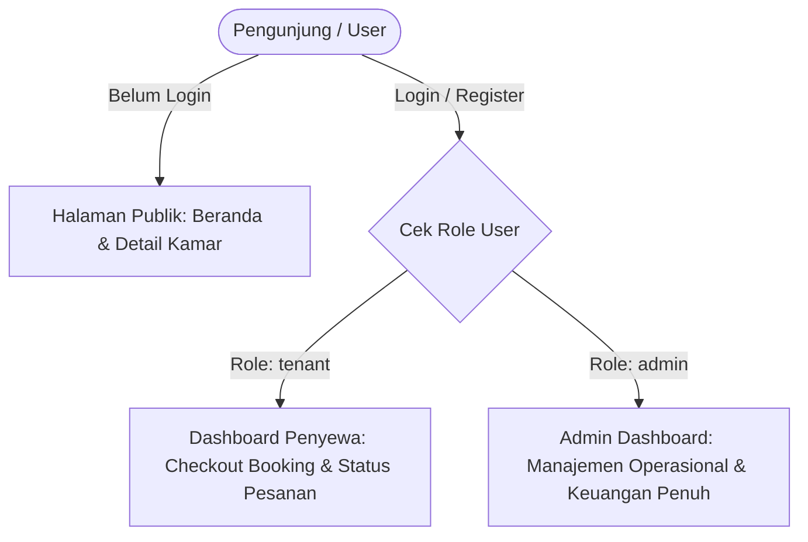

1. **Guest (Tamu Publik)**:
   - Melihat daftar kamar yang berstatus *published* dan *available*.
   - Mencari kamar berdasarkan nomor, fasilitas, dan tipe.
   - Melihat detail spesifikasi kamar, aturan kost, dan galeri foto.
2. **Tenant (Penyewa Terdaftar)**:
   - Melakukan checkout pemesanan kamar online (*booking*).
   - Mengunggah identitas (NIK, No WA, Gender) dan bukti pembayaran transfer.
   - Memantau status verifikasi booking (`pending`, `approved`, `rejected`) di `/dashboard-penyewa`.
3. **Admin (Pengelola Kost)**:
   - Akses penuh ke seluruh menu operasional dan keuangan kost.
   - Menyetujui atau menolak pesanan booking online.
   - Mengontrol konfigurasi aplikasi, data kamar, penyewa, transaksi kas, dan audit log.

---

## 3. Struktur Database & Diagram Relasi (ERD)

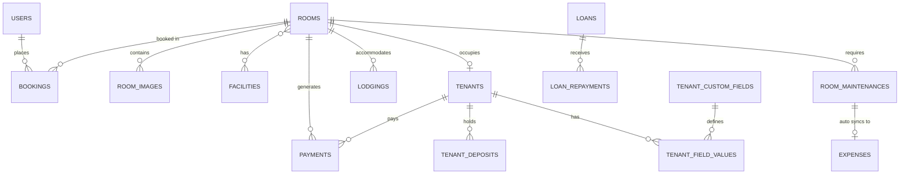

### Penjelasan Entitas Utama:
- **`rooms`**: Data fisik kamar (nomor, lantai, tipe, harga, ukuran sqm, status, flag publikasi `is_published`, foto utama).
- **`room_images`**: Galeri multi-foto untuk setiap kamar.
- **`facilities`** & **`room_facility`**: Data master fasilitas dan tabel pivot kamar-fasilitas.
- **`users`**: Akun pengguna sistem (`admin` atau `tenant`).
- **`bookings`**: Transaksi pemesanan kamar online dari publik.
- **`tenants`**: Data lengkap identitas penyewa tetap kamar kost.
- **`tenant_deposits`**: Buku besar deposit/uang jaminan penyewa (`credit` = masuk, `debit` = klaim/keluar).
- **`payments`**: Transaksi penerimaan uang sewa kamar kost per periode bulan/tahun.
- **`lodgings`**: Transaksi sewa harian/penginapan jangka pendek (tamu transit).
- **`room_maintenances`**: Laporan servis/kerusakan kamar dan biaya perbaikan.
- **`expenses`**: Pengeluaran operasional kost (listrik, wifi, gaji, pemeliharaan).
- **`other_incomes`**: Pendapatan operasional lain di luar sewa kamar (laundry, denda, parkir).
- **`loans`** & **`loan_repayments`**: Buku catatan piutang kost (*receivables*) dan hutang kost (*payables*).
- **`system_logs`**: Rekaman jejak audit (*audit trail*) seluruh operasi penambahan, perubahan, dan penghapusan data.

---

## 4. Alur Pengguna Publik & Penyewa (Public & Tenant Flow)

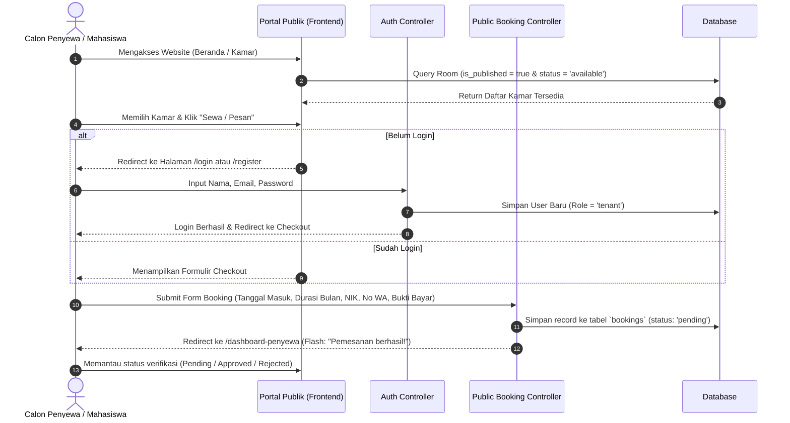

---

## 5. Alur Booking Online & Approval Admin

Ketika calon penyewa melakukan submit pemesanan kamar secara online, data masuk ke antrean verifikasi admin di `/admin/bookings`.

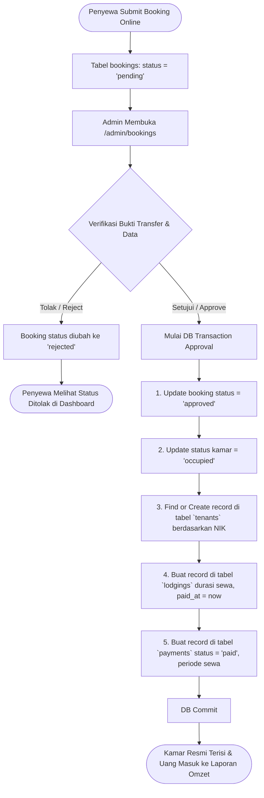

### Logika Otomatisasi saat Approval:
1. **Status Booking**: Berubah menjadi `approved`.
2. **Kamar**: Otomatis berubah status menjadi `occupied` (tidak lagi tampil di pencarian publik).
3. **Penyewa (`tenants`)**: Dibuat secara otomatis jika NIK belum ada, atau dihubungkan ke kamar jika sudah terdaftar.
4. **Penginapan (`lodgings`)**: Record penginapan dibuat dengan status `paid` sesuai total bayar dan durasi bulan.
5. **Pembayaran (`payments`)**: Record pembayaran lunas langsung dicatat pada periode bulan dan tahun tanggal masuk sewa.

---

## 6. Alur Manajemen Kamar & Ketersediaan

Admin dapat mengelola seluruh siklus hidup kamar melalui menu **Database Kamar** (`/rooms`).

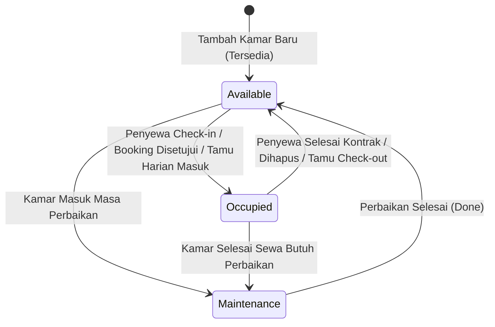

### Fitur Kunci Manajemen Kamar:
- **Grouping per Lantai**: Daftar kamar dikelompokkan berdasarkan lantai (`Floor`) tanpa jeda pagination untuk kemudahan pemantauan visual.
- **Galeri Multi-Foto**: Upload banyak foto kamar dengan foto utama sebagai cover.
- **Fasilitas Kamar**: Menghubungkan fasilitas (AC, Kasur, Kamar Mandi Dalam, WiFi, Meja Belajar, Lemari) menggunakan relasi *many-to-many*.
- **Publikasi Kamar (`is_published`)**: Toggle untuk mengatur apakah kamar ditampilkan di portal publik mahasiswa atau hanya dicatat secara internal.
- **Forecast Kamar Kosong (`/rooms/vacant-forecast`)**: Memfilter kamar-kamar yang kontrak sewanya (`end_date`) akan segera habis pada bulan & tahun tertentu, memudahkan admin mempersiapkan promosi calon penyewa berikutnya.

---

## 7. Alur Siklus Hidup Penyewa (Tenant Lifecycle)

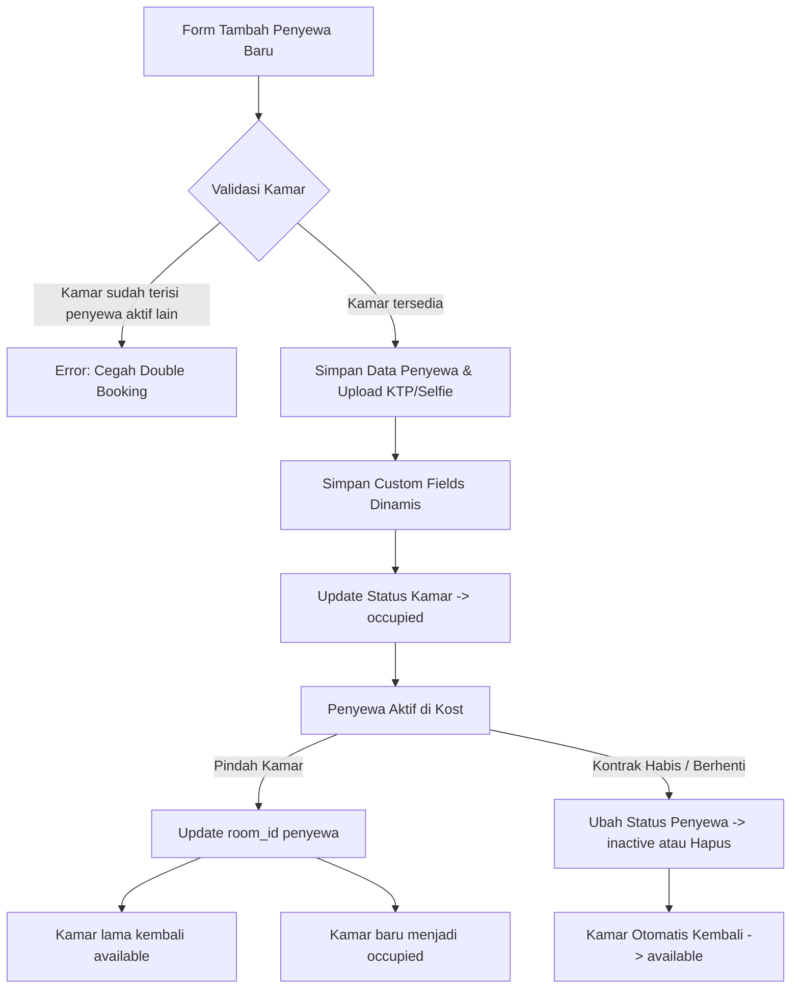

### Fitur Kunci Data Penyewa:
- **Validasi Anti Double-Booking**: Mencegah dua penyewa berstatus `active` menempati kamar yang sama secara bersamaan.
- **Kontak Darurat Ganda**: Mendukung data kontak orang tua / wali 1 dan kontak darurat 2.
- **Dynamic Custom Fields**: Admin dapat menambah kolom data khusus secara dinamis di menu Pengaturan (misal: nomor plat kendaraan, kampus, program studi, ukuran kasur).
- **Soft Deletes**: Data penyewa yang dihapus tetap memiliki cadangan riwayat.

---

## 8. Alur Deposit Jaminan Penyewa (Tenant Deposit)

Deposit adalah uang jaminan kerusakan/kunci yang disetorkan penyewa di awal masa sewa.

> [!IMPORTANT]
> **Prinsip Akuntansi Deposit**: Deposit penyewa adalah **titipan/kewajiban (liabilitas)**, sehingga **TIDAK** dihitung sebagai omzet pendapatan operasional. Namun pergerakan fisik uangnya dicatat di laporan Arus Kas (*Cash Flow*).

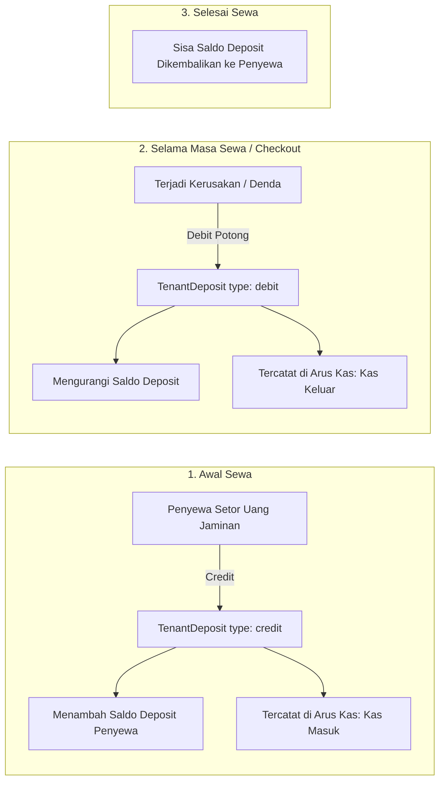

### Validasi Saldo Deposit:
Sistem secara otomatis mencegah admin mencatat potongan debit yang nilainya melebihi sisa saldo deposit aktif milik penyewa tersebut.

---

## 9. Alur Transaksi & Penerimaan Keuangan

Menu **Penerimaan** (`/payments`) mengelola seluruh aliran dana masuk dari penyewa bulanan, tamu harian, pendapatan lain, dan deposit jaminan.

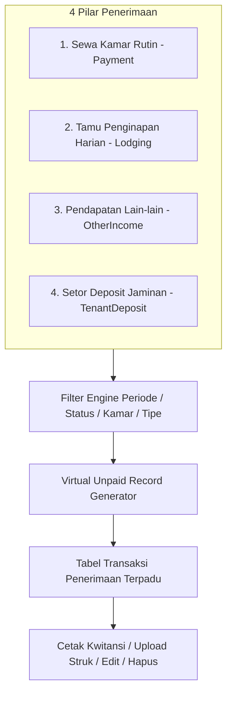

### Mekanisme Khusus: Virtual Unpaid Tagihan Sewa
Sistem memiliki mesin cerdas (*Virtual Unpaid Engine*):
- Ketika admin memilih filter periode bulan & tahun tertentu, sistem memeriksa seluruh penyewa aktif (`Tenant active`).
- Jika ada penyewa yang belum memiliki record pembayaran pada periode tersebut (dan tanggal sewa penyewa mencakup periode tersebut), sistem **secara otomatis menampilkan baris tagihan virtual** berstatus `pending` atau `overdue`.
- Admin tidak perlu membuat data tagihan kosong secara manual di database.
- Admin cukup klik tautan tagihan virtual tersebut untuk langsung membuka form pencatatan pembayaran.

### Otomatisasi Jatuh Tempo (*Auto-mark Overdue*):
- Tanggal jatuh tempo dikonfigurasi melalui setting `payment_due_day` (default tanggal 10 setiap bulan).
- Setiap kali halaman pembayaran dibuka, sistem secara otomatis mengevaluasi tanggal: jika hari ini > tanggal jatuh tempo dan status masih `pending`, status otomatis diperbarui menjadi `overdue`.

---

## 10. Alur Penginapan Harian / Transit (Lodging)

Modul **Penginapan** (`/lodgings`) menangani penyewaan kamar dengan sistem tarif harian/malam.

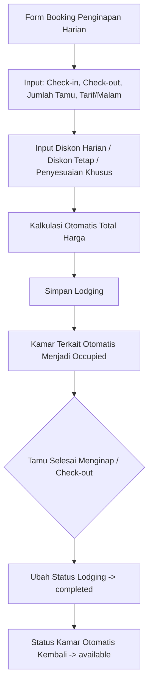

### Formula Kalkulasi Otomatis:
$$\text{Total Bayar} = \left( (\text{Tarif/Malam} - \text{Diskon Harian}) \times \text{Jumlah Tamu} \times \text{Jumlah Hari} \right) - \text{Diskon Tetap} - \text{Penyesuaian Khusus}$$

---

## 11. Alur Pemeliharaan Kamar (Maintenance) & Sinkronisasi Biaya

Modul **Maintenance Kamar** (`/maintenances`) mencatat perbaikan inventaris, fasilitas rusak, atau renovasi kamar kost.

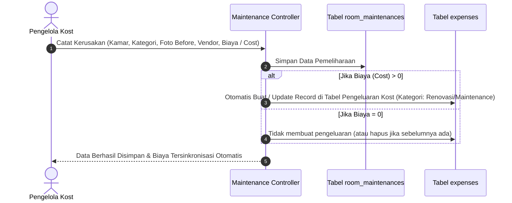

---

## 12. Alur Pengeluaran Kost (Expenses)

Modul **Pengeluaran Kost** (`/expenses`) mencatat seluruh beban operasional:
- Listrik & Token PLN
- Air PDAM / Tagihan Pompa
- Internet & WiFi
- Kebersihan & Sampah
- Gaji Karyawan / Penjaga Kost
- Pemeliharaan & Renovasi (tersinkronisasi dari modul maintenance)
- Pengeluaran operasional umum lainnya

Pengeluaran ini terikat pada periode bulan dan tahun pelaporan untuk pembukuan laba/rugi dan arus kas.

---

## 13. Alur Hutang & Piutang (Loans & Repayments)

Sistem membedakan secara tegas antara **Piutang Kost** (*Receivables*) dan **Hutang Kost** (*Payables*).

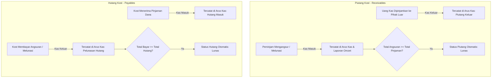

### Fitur Saldo Bebas (*Unlinked Repayments*):
Admin dapat mencatat transaksi pelunasan/angsuran terlebih dahulu ke kas tanpa langsung memilih data pinjaman, kemudian menautkannya (*link*) ke pinjaman terkait di lain waktu.

---

## 14. Alur Laporan Keuangan & Arus Kas (Reporting Engine)

Sistem menyediakan 3 laporan keuangan berbasis *Cash Basis* yang presisi:

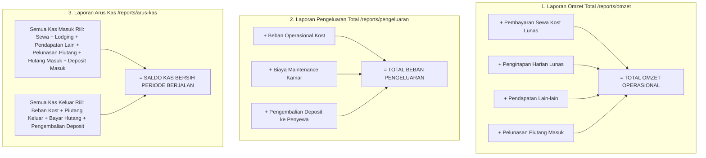

### Tabel Matriks Perbandingan Laporan:

| Jenis Transaksi | Masuk Laporan Omzet? | Masuk Laporan Pengeluaran? | Masuk Laporan Arus Kas? |
|---|:---:|:---:|:---:|
| **Sewa Kost Bulanan (Lunas)** | ✅ Ya (Pendapatan) | ❌ Tidak | ✅ Kas Masuk |
| **Penginapan Harian (Lunas)** | ✅ Ya (Pendapatan) | ❌ Tidak | ✅ Kas Masuk |
| **Pendapatan Lain-lain** | ✅ Ya (Pendapatan) | ❌ Tidak | ✅ Kas Masuk |
| **Pelunasan Piutang Diterima** | ✅ Ya (Kas Kembali) | ❌ Tidak | ✅ Kas Masuk |
| **Beban Operasional Kost** | ❌ Tidak | ✅ Ya (Beban) | ✅ Kas Keluar |
| **Biaya Perbaikan/Maintenance** | ❌ Tidak | ✅ Ya (Beban) | ✅ Kas Keluar |
| **Setoran Deposit Penyewa Masuk** | ❌ **Tidak** (Kewajiban) | ❌ Tidak | ✅ Kas Masuk |
| **Pengembalian Deposit ke Penyewa**| ❌ Tidak | ✅ Ya (Uang Keluar) | ✅ Kas Keluar |
| **Penerimaan Pinjaman (Hutang Masuk)**| ❌ **Tidak** (Kewajiban) | ❌ Tidak | ✅ Kas Masuk |
| **Pelunasan Hutang ke Pihak Luar** | ❌ Tidak | ❌ Tidak | ✅ Kas Keluar |
| **Uang Dipinjamkan (Piutang Keluar)** | ❌ Tidak | ❌ Tidak | ✅ Kas Keluar |

---

## 15. Alur Pengaturan Master Data & Audit Trail (System Logs)

```mermaid
flowchart LR
    subgraph MasterData [Master Data & Settings]
        S1[Lantai / Floors]
        S2[Tipe Kamar / Room Types]
        S3[Fasilitas / Facilities]
        S4[Kategori Maintenance]
        S5[Kategori Pengeluaran]
        S6[Custom Field Penyewa]
        S7[Jatuh Tempo & Tarif Harian Default]
    end

    subgraph AuditTrail [Audit Trail Otomatis]
        Action[Setiap Aksi Create / Update / Delete di Model] --> Trait[LogsActivity Trait]
        Trait --> RecordLog[Insert SystemLog: Menu, Aksi, Deskripsi, Data Lama, Data Baru, Timestamp]
        RecordLog --> Viewer[/system-logs View]
    end
```

### Logika Audit Trail Otomatis (`LogsActivity`):
- Seluruh model utama (`Room`, `Tenant`, `Payment`, `Expense`, `RoomMaintenance`, `Lodging`, `OtherIncome`, `Loan`, `LoanRepayment`, `TenantDeposit`, `User`, `AppSetting`) mengimplementasikan trait `LogsActivity`.
- Setiap kali data ditambahkan, diubah, atau dihapus, sistem secara otomatis merekam:
  1. Menu & model yang terpengaruh.
  2. Jenis aksi (`Ditambahkan`, `Diperbarui`, `Dihapus`).
  3. Snapshot data sebelum diubah (*old data*) dan data sesudah diubah (*new data*).
  4. Deskripsi aktivitas yang mudah dibaca manusia.
- Log ini dapat dipantau dan difilter melalui menu **System Logs** (`/system-logs`).

---

## 🏁 Kesimpulan

Sistem Informasi Kost TBU 4 Malang dirancang dengan alur kerja terpadu:
- Menghubungkan proses **promosi & pemesanan publik** secara mulus ke **pencatatan penyewa dan keuangan admin**.
- Menjaga integritas data dengan **validasi anti-double booking**, **otomatisasi status kamar**, dan **sinkronisasi otomatis biaya pemeliharaan**.
- Menerapkan **prinsip akuntansi cash basis yang sehat** dalam memisahkan omzet riil, beban operasional, pergerakan hutang-piutang, dan dana titipan deposit.
- Memastikan keamanan operasional melalui **pencatatan audit log otomatis** di setiap aktivitas sistem.
